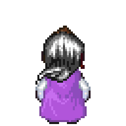
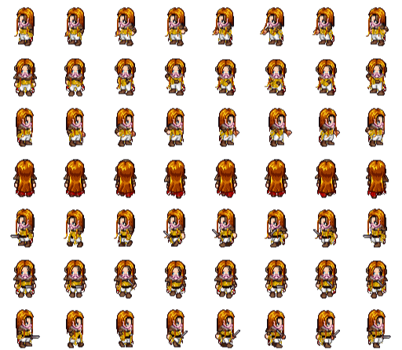
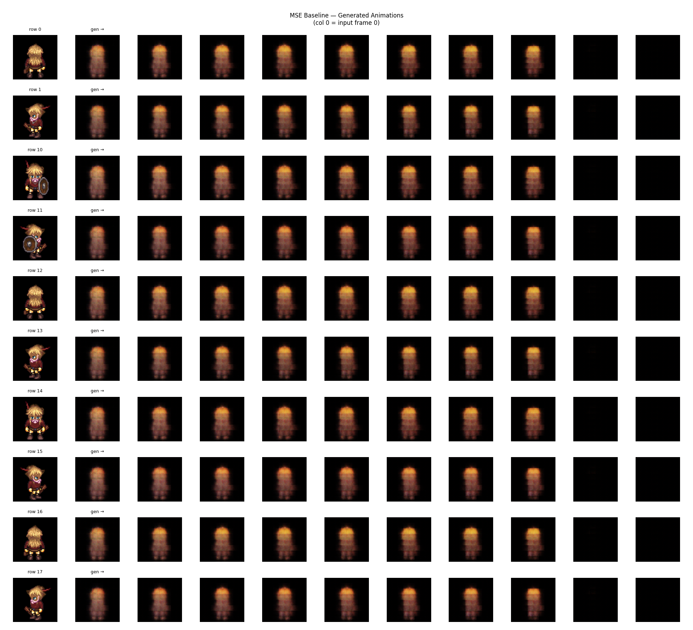
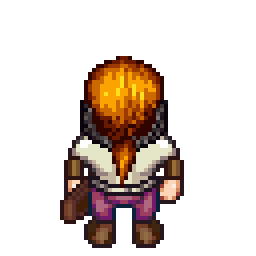
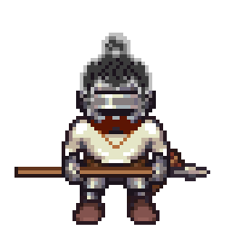

# Pixel Sprite Animation From a Single Frame

This project compares three ways to generate small 2D game animations from a single sprite frame: deterministic warping, a learned sequential transformer, and a large image-to-video model (Wan2.2). 

<p align="center">
  
  
  
  
</p>

## link to trained weight for optimal model: https://drive.google.com/file/d/1-XOIEJaB_HS8Vc2rQ5HXzE4iJZHI3qZ7/view?usp=sharing

## Project Overview

The original goal was to support a game-editor workflow where a developer provides one idle or first-frame sprite and receives a short action animation without drawing every frame manually. The project studies the quality, flexibility, and compute tradeoffs across three levels:

| Level | Method | Strength | Limitation |
| --- | --- | --- | --- |
| 1 | TPS / RBF warp | Very fast and deterministic | Cannot create occluded details or new structure |
| 2 | MSE transformer baseline | Learns row-specific motion order | Blurs outlines and tiny pixel-art details |
| 3 | Transformer with updated objective function | Best current quality-compute balance | Still tied to LPC-style sprites, need retraining for new animations |
| Modern option | Wan2.2 image-to-video | Highest capacity | Heavy, slower, harder to control, visually overkill |

## Data Pipeline

The dataset is built from the Universal LPC spritesheet assets. `create_dataset.py` samples compatible body, clothing, hair, accessory, and weapon layers in a fixed order, composites them into full character sheets, then slices each sheet into independent 64-pixel-high animation rows.



Each training example is:

- Input: frame 0 from a row strip.
- Conditioning: the animation row label.
- Target: the remaining frames from the same row.

The generated dataset defaults to 1,000 composited characters: 500 male and 500 female entries. 

## Level 1: TPS / RBF Warp

The lowest-compute baseline moves existing sprite pixels through a hand-authored control-point rig. Thin-plate-spline / RBF deformation is fast and deterministic, which makes it useful as a preview or editor-side tool.


Its ceiling is low: large pose changes stretch pixels, break silhouettes, and fail when limbs, weapons, or clothing need newly visible structure. The method is strongest when the input sprite closely matches the assumed rig and motion template.

## Level 2: MSE Transformer Baseline

The first learned model used a patch-based sequence-to-sequence transformer trained with MSE. It learned broad row-level motion structure, but pixel art is especially sensitive to high-frequency detail. MSE rewards averaged futures, so edges, palettes, faces, and weapons became soft.




## Level 3: Restored Transformer

This version uses a BOS-token transformer, row-label conditioning, patch skip connections, perceptual loss, SSIM, and a lightweight patch discriminator.

<p align="center">
  
  
</p>

### Model Details

- Frame size: `64 x 64`
- Patch size: `4 x 4`
- Patch tokens per frame: `256`
- Patch dimension: `48`
- Default model width: `512`
- Attention heads: `8`
- Encoder layers: `6`
- Decoder layers: `6`
- Feed-forward width: `2048`
- Max temporal positions: `64`
- Conditioning: animation row label prepended to encoded frame tokens
- Generation: target frames are produced from frame 0 and row label

### Training Objective

The restored objective combines reconstruction quality, structure, and adversarial sharpness:

```text
generator_loss = 0.1 * L1 + 0.1 * VGG perceptual + 0.5 * SSIM + 0.001 * adversarial
```

The discriminator uses noisy real/fake inputs, one-sided real labels, and starts after a warmup:

- GAN warmup: `5` epochs
- Discriminator noise: `0.05`
- Real label smoothing: `0.9`
- Adversarial weight: `0.001`

### Default Hyperparameters


| Parameter | Default |
| --- | --- |
| Epochs | `250` |
| Batch size | `128` |
| Learning rate | `1e-4` |
| Minimum learning rate | `1e-6` |
| Optimizer | `AdamW` |
| Generator weight decay | `1e-4` |
| Discriminator learning rate | `1e-4` |
| Discriminator betas | `(0.5, 0.999)` |
| Curriculum min frames | `2` |
| Train / validation split | `80 / 20` |


## Wan2.2

The Wan2.2 experiment has a higher theoretical ceiling, but it is much heavier than the transformer method and tends to inherit a high-resolution video prior that is not naturally aligned with tiny pixel sprites.

<p align="center">
  
  
</p>


## Running the Project

Install the Python dependencies, and clone the LPC Sprite Sheet repo.

Create the LPC-derived dataset:

```bash
python create_dataset.py
```

Train the restored transformer:

```bash
python train.py
```

Resume from the old best checkpoint:

```bash
python train.py --resume best_model_old.pt
```

Run inference with the restored default checkpoint:

```bash
python infer.py --checkpoint best_model_old.pt --num_samples 10
```

Outputs are written to:

- `model_output/` for PNG strips and GIF animations.
- `plot/inference_grid.png` for a static comparison grid.
- `checkpoints/` for training checkpoints.
