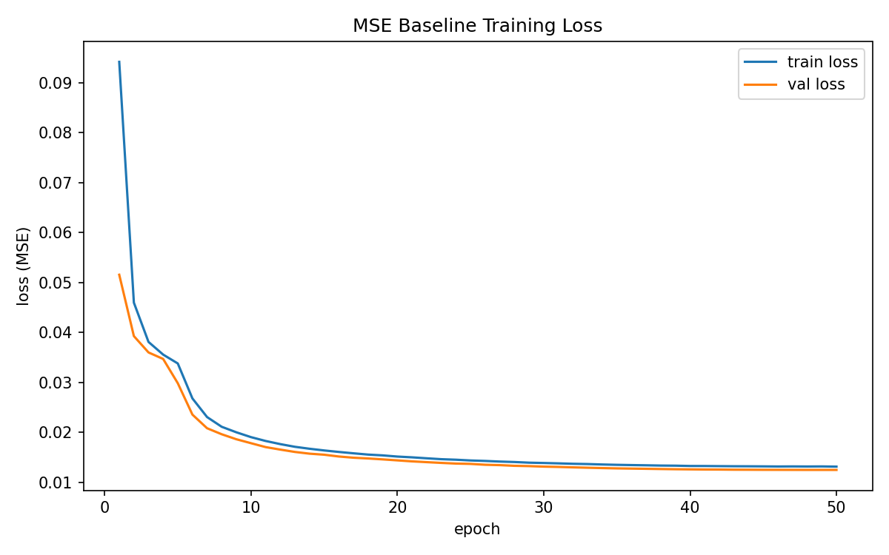
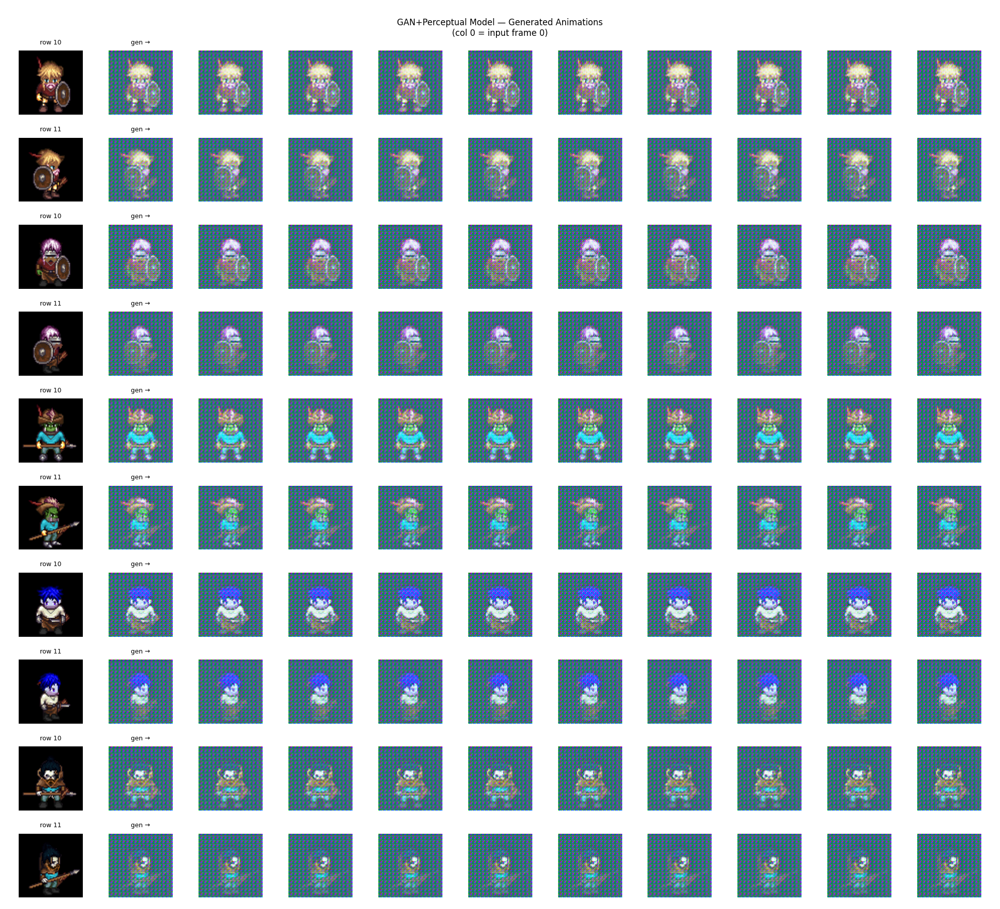

# Project Milestone 2

## Goal
Generate short animations for 2D game sprites given a single reference frame and an animation-row label.

## Why Not a Pretrained I2V Model (e.g. Wan2.2)?
Pretrained image-to-video models are trained on realistic, high-FPS natural video. Pixel-art sprites are low-resolution (64×64), have hard edges, transparent backgrounds, and repeat in structured loops — a fundamentally different domain that causes pretrained models to hallucinate textures and ignore sprite structure.

---

## My Method: Patch-Based Seq2Seq Transformer

A custom `SpriteSeq2Seq` transformer that treats each 64×64 frame as 64 non-overlapping 8×8 patches. Given frame 0 + an animation label, the encoder builds a memory context; the decoder autoregressively predicts subsequent frames patch-by-patch.

---

## Hurdle 1: Low Fidelity / Blurry Outputs (MSE Loss)

**Problem:** MSE loss minimizes average pixel error, producing blurry "averaged" outputs with correct pose structure but no sharp detail.

**Solution applied:**
- Replaced MSE with a combined loss: `0.1 × pixel L1 + 1.0 × perceptual + 0.5 × SSIM`
- Added a PatchGAN discriminator with adversarial loss to force high-frequency sharpness

---

## Hurdle 2: GAN Collapse

**Problem:** The discriminator converged to near-zero loss by epoch 2, giving the generator zero gradient signal. Outputs became pure artifacts.

**Solution applied:**
- 5-epoch warm-up: discriminator frozen for first 5 epochs, letting the generator stabilize first
- Label smoothing: real labels set to 0.9 instead of 1.0
- Instance noise: Gaussian noise (σ=0.05) added to discriminator inputs to slow convergence
- Reduced adversarial weight: 0.01 → 0.001 so reconstruction loss dominates

Result: discriminator loss now stabilizes.

## Results

### MSE Baseline

The baseline model produces blury but somewhat structurally correct results. The visual fidelity is held back by mse's tendency to achieve an average, blurry result.

### Improved model (in progress)

The model produces structurally correct sprite poses across generated frames, demonstrating that the transformer has learned to condition on the input frame and animation label. Output fidelity and sharpness are still under improvement — while the combined perceptual (VGG16), SSIM, and GAN losses reduce the blurring characteristic of pure MSE training, significant artifact can still be observed. Skip connections from encoder patches and curriculum learning were added to improve spatial preservation and early convergence respectively, and further gains are expected as training continues toward the target epoch range. Compared to the MSE baseline, 

